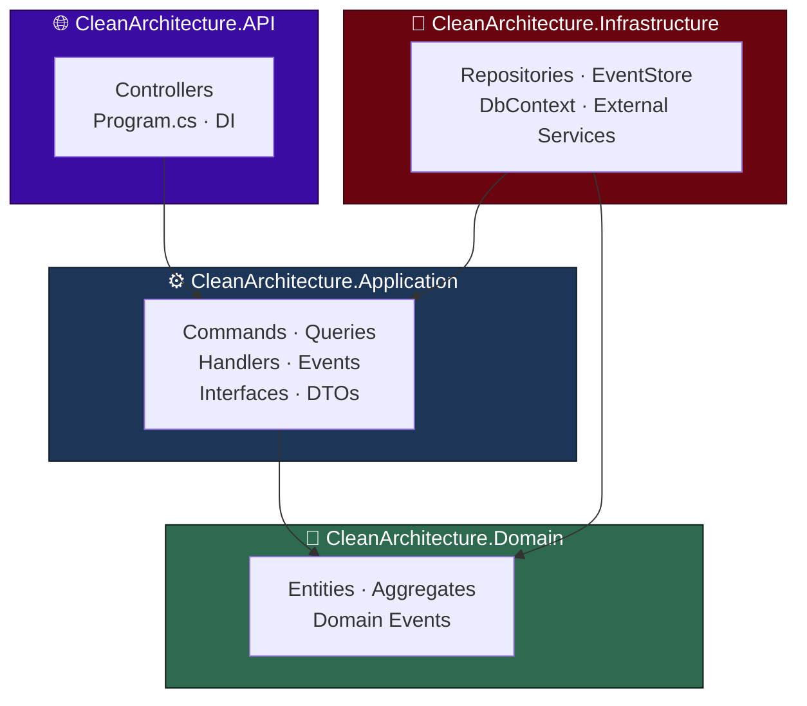
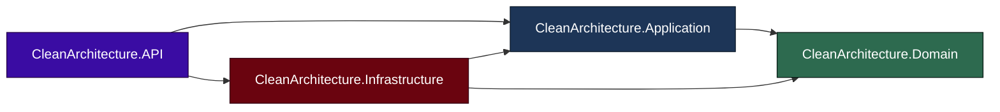
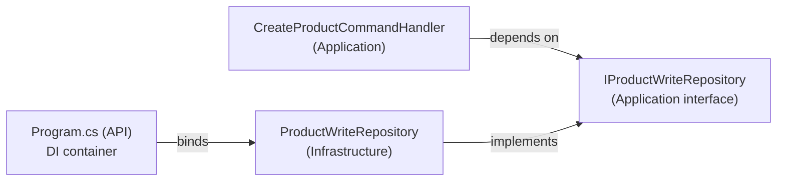
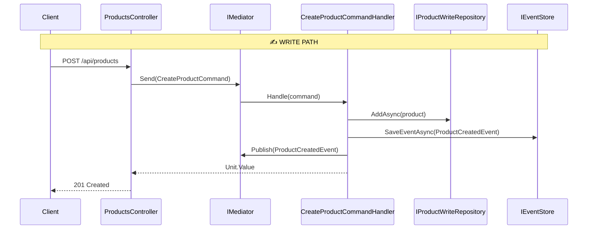
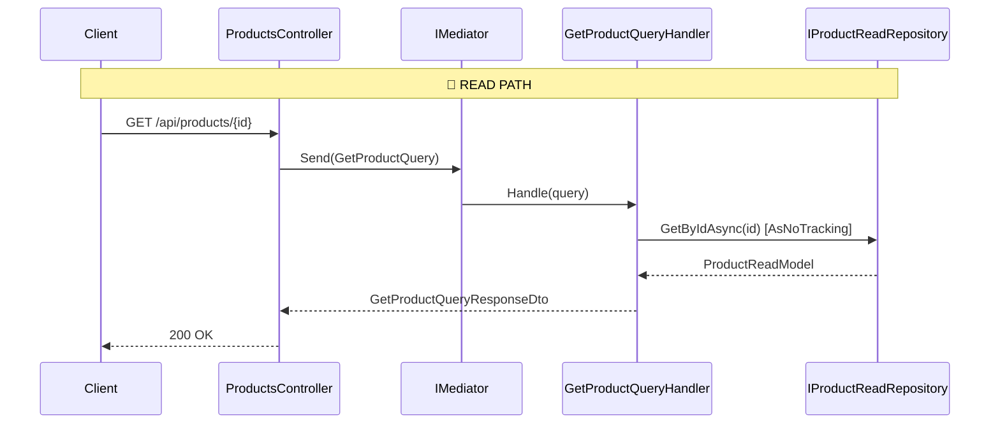
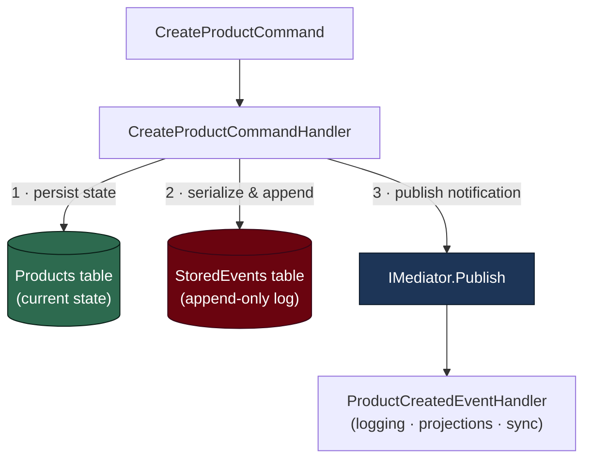
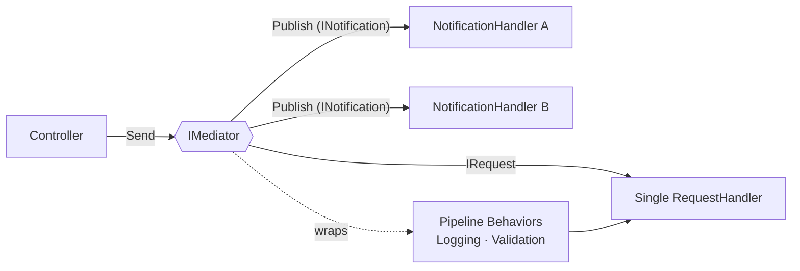
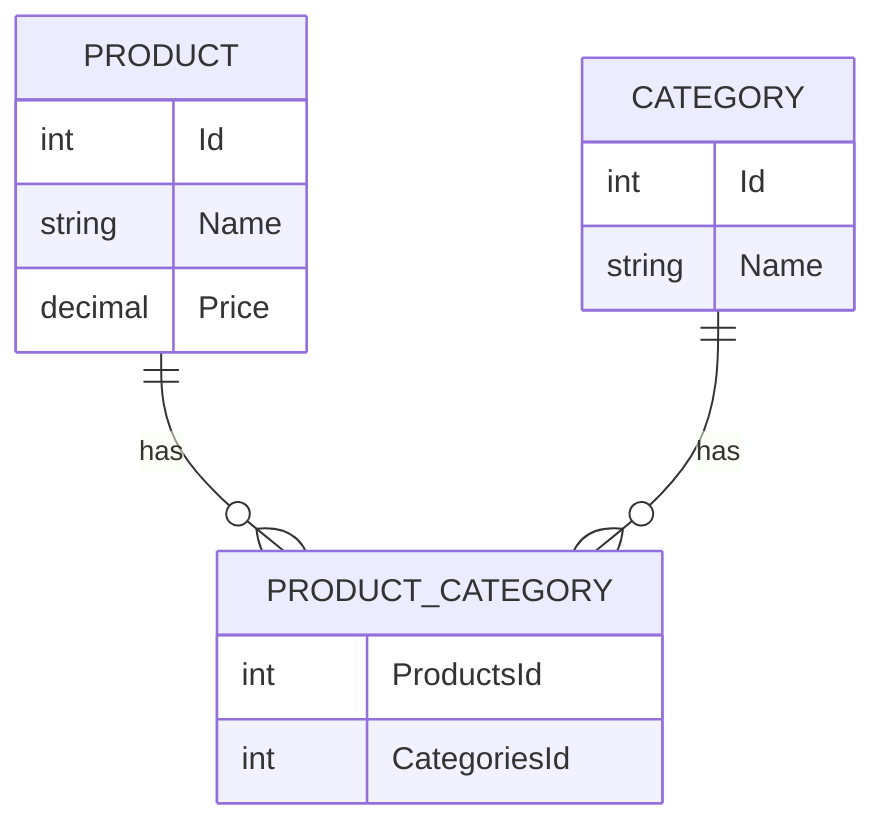

# 🏛️ CleanArchitectureCQRS

> Enterprise-grade reference solution built with **.NET 10**, **ASP.NET Core Web API**, **Clean Architecture**, **CQRS**, **Event Sourcing**, and **MediatR**.

<p align="center">
  
  
  
  
  
</p>

<p align="center">
  
  
  
  
  
  
</p>

---

## 📑 Table of Contents

- [🧭 Overview](#-overview)
- [🎯 Functional & Technical Goals](#-functional--technical-goals)
- [🧰 Technology Stack](#-technology-stack)
- [📦 Libraries & NuGet Packages](#-libraries--nuget-packages)
- [🏗️ Solution Architecture](#️-solution-architecture)
- [🧅 Clean Architecture in Depth](#-clean-architecture-in-depth)
- [🔀 CQRS in Depth](#-cqrs-in-depth)
- [📜 Event Sourcing in Depth](#-event-sourcing-in-depth)
- [📨 MediatR in Depth](#-mediatr-in-depth)
- [🏷️ Categories & the Many-to-Many Relationship](#️-categories--the-many-to-many-relationship)
- [🗂️ Folder Structure](#️-folder-structure)
- [🌳 Solution Tree](#-solution-tree)
- [🚀 Building the Solution From Scratch](#-building-the-solution-from-scratch)
- [💻 Real C# Code Examples](#-real-c-code-examples)
- [🪵 Logging & Observability](#-logging--observability)
- [🧯 Error Handling](#-error-handling)
- [🧪 Testing](#-testing)
- [⚙️ CI/CD](#️-cicd)
- [▶️ Running Locally](#️-running-locally)
- [🛣️ Roadmap](#️-roadmap)
- [⚖️ Architectural Decisions & Trade-offs](#️-architectural-decisions--trade-offs)
- [📖 Glossary](#-glossary)
- [📄 License](#-license)

---

## 🧭 Overview

**CleanArchitectureCQRS** is a production-oriented reference implementation of an **ASP.NET Core Web API** that demonstrates how to combine four powerful architectural ideas inside a single, cohesive .NET solution:

| Concept | Role in the solution |
|---------|----------------------|
| 🧅 **Clean Architecture** | Enforces a strict dependency rule — all dependencies point **inward** toward the Domain. |
| 🔀 **CQRS** | Splits the **write** path (Commands) from the **read** path (Queries) into independent models. |
| 📜 **Event Sourcing (hybrid)** | Persists every business fact as an **immutable event** alongside the current state. |
| 📨 **MediatR** | Decouples controllers from handlers by dispatching Commands, Queries, and Domain Events. |

The canonical business capabilities implemented are a **Product catalog** and a **Category catalog** (with a **many-to-many** relationship between products and categories), plus an integration to an **external Product Quality API**, showing how the same dependency-inversion pattern applies equally to databases and HTTP services.

The solution is organized into **four projects** that map directly to the four Clean Architecture layers:

```
CleanArchitecture.Domain          → Enterprise business rules (entities, domain events)
CleanArchitecture.Application     → Application business rules (commands, queries, handlers, contracts)
CleanArchitecture.Infrastructure  → Frameworks & drivers (EF Core, EventStore, external services)
CleanArchitecture.API             → Presentation (Controllers, DI composition root, Program.cs)
```

---

## 🎯 Functional & Technical Goals

### Functional goals

- ✅ **Create a product** through a `POST /api/products` endpoint that writes state and records an immutable domain event.
- ✅ **Read a product** through `GET /api/products/{id}` using an optimized read model.
- ✅ **Query product quality** through `GET /api/products/{id}/quality`, delegating to an external API behind an anti-corruption interface.
- ✅ **Create a category** through `POST /api/categories`, optionally associating existing products (many-to-many).
- ✅ **Read a category** through `GET /api/categories/{id}`, returning the category together with its associated products.
- ✅ **Audit & traceability** of every business fact via an append-only event store.

### Technical goals

- 🎯 Demonstrate a **strict inward dependency rule** (Clean Architecture).
- 🎯 Achieve **read/write segregation** with distinct repositories (`AsNoTracking` for reads, change tracking for writes).
- 🎯 Provide a **hybrid Event Sourcing** model (current state + event log).
- 🎯 Keep the **Domain framework-agnostic** (no EF Core, no ASP.NET references).
- 🎯 Use **MediatR** as the single in-process message bus for Commands, Queries, and Notifications.
- 🎯 Make every cross-cutting concern (logging, validation, error handling) a **pipeline behavior**, not handler noise.
- 🎯 Treat **external services exactly like repositories**: interface in Application, implementation in Infrastructure.

---

## 🧰 Technology Stack

| Layer | Technology |
|-------|------------|
| **Runtime** | .NET 10 |
| **Language** | C# 14 |
| **Web framework** | ASP.NET Core Web API (Controllers) |
| **Mediator** | MediatR |
| **ORM** | Entity Framework Core |
| **Database** | SQL Server (single instance, shared by state + event store) |
| **Validation** | FluentValidation (recommended via MediatR pipeline) |
| **HTTP integration** | `IHttpClientFactory` + typed `HttpClient` |
| **Serialization** | `System.Text.Json` |
| **Logging** | `Microsoft.Extensions.Logging` (+ Serilog recommended) |
| **API docs** | OpenAPI / Swagger |
| **Testing** | xUnit + Moq + FluentAssertions |
| **Resilience** | Polly (recommended for external services) |

---

## 📦 Libraries & NuGet Packages

Packages are installed **per project** so each layer only references what it actually needs.

### `CleanArchitecture.Domain`

> 🟢 No external NuGet packages. The Domain is intentionally **pure** — only the BCL.

### `CleanArchitecture.Application`

| Package | Purpose |
|---------|---------|
| `MediatR` | Command/Query/Event dispatching and `IRequest`/`INotification` contracts. |
| `FluentValidation` | Declarative validation rules for commands and queries. |
| `Microsoft.Extensions.Logging.Abstractions` | `ILogger<T>` abstractions without binding to a sink. |

### `CleanArchitecture.Infrastructure`

| Package | Purpose |
|---------|---------|
| `Microsoft.EntityFrameworkCore` | Core ORM abstractions. |
| `Microsoft.EntityFrameworkCore.SqlServer` | SQL Server provider. |
| `Microsoft.EntityFrameworkCore.Design` | Migrations & design-time tooling. |
| `Microsoft.Extensions.Http` | `IHttpClientFactory` for typed clients. |
| `Microsoft.Extensions.Configuration.Abstractions` | Binding `appsettings.json` sections. |
| `Polly` *(recommended)* | Retries and circuit breakers for external calls. |

### `CleanArchitecture.API`

| Package | Purpose |
|---------|---------|
| `MediatR` | Resolve and dispatch from controllers. |
| `Microsoft.EntityFrameworkCore.Design` | `dotnet ef` commands run from the startup project. |
| `Swashbuckle.AspNetCore` | OpenAPI/Swagger UI. |
| `Serilog.AspNetCore` *(recommended)* | Structured logging. |

---

## 🏗️ Solution Architecture

The project implements **Clean Architecture** with **4 layers**, applies **CQRS** to separate read and write models, complements it with **hybrid Event Sourcing** to record all domain events, and integrates with **external services** via `HttpClient` following the same dependency-inversion principle.

### Layer diagram (Mermaid)



### Project dependency diagram (Mermaid)



> 🔑 **The golden rule:** `Domain` depends on **nothing**. `Application` depends only on `Domain`. `Infrastructure` implements `Application` contracts. `API` is the composition root that wires everything together.

---

## 🧅 Clean Architecture in Depth

Clean Architecture (Robert C. Martin) organizes software into concentric layers where **source code dependencies always point inward**. Inner layers know nothing about outer layers.

### The four layers in this solution

| Layer | Project | Knows about | Never references |
|-------|---------|-------------|------------------|
| 💎 **Enterprise Business Rules** | `Domain` | Nothing | EF Core, ASP.NET, MediatR sinks |
| ⚙️ **Application Business Rules** | `Application` | `Domain` | EF Core, SQL Server, HttpClient |
| 🔌 **Interface Adapters / Frameworks** | `Infrastructure` | `Application`, `Domain` | `API` |
| 🌐 **Frameworks & Drivers** | `API` | `Application`, `Infrastructure` | — |

### Why interfaces live in `Application`

A core idea is the **Dependency Inversion Principle (DIP)**. Instead of `Application` calling `Infrastructure` directly, `Application` declares **what it needs** as interfaces:

- `IProductWriteRepository`, `IProductReadRepository`
- `IEventStore`
- `IProductQualityService`

`Infrastructure` then provides **how to do it** (`ProductWriteRepository`, `EventStoreRepository`, `ProductQualityService`). At runtime, the `API` composition root binds the interfaces to implementations through DI.



### Benefits realized

- 🧪 **Testability** — handlers are tested with mocked interfaces, no database required.
- 🔁 **Replaceability** — swap SQL Server for PostgreSQL or the external API for a stub without touching business logic.
- 🛡️ **Stability** — volatile concerns (frameworks, databases) live on the outside; stable business rules live on the inside.

---

## 🔀 CQRS in Depth

**CQRS (Command Query Responsibility Segregation)** separates operations that **change state** (Commands) from operations that **return data** (Queries). Each side gets its own model, optimized for its job.

| Aspect | ✍️ Write side (Command) | 📖 Read side (Query) |
|--------|------------------------|----------------------|
| Intent | Mutate state | Return data |
| Type | `CreateProductCommand : IRequest<Unit>` | `GetProductQuery : IRequest<GetProductQueryResponseDto>` |
| Handler | `CreateProductCommandHandler` | `GetProductQueryHandler` |
| Contract | `IProductWriteRepository` | `IProductReadRepository` |
| EF Core | Change tracking enabled | `AsNoTracking()` projection |
| Model | `Product` (domain entity) | `ProductReadModel` (immutable record) |
| Return | `Unit.Value` (no data) | DTO / read model |

### CQRS flow (Mermaid)





> 💡 This is **logical CQRS over a single database**. The write and read repositories share one `ProductDbContext` / SQL Server instance but use different strategies. You can later evolve toward **physical CQRS** (separate read store) without changing controllers or handlers.

---

## 📜 Event Sourcing in Depth

**Event Sourcing** records every relevant business fact as an **immutable event**. In this solution we use a **hybrid** approach.

### What "hybrid" means here

We persist **both**:

1. 🗃️ **Current state** in the `Products` table (fast queries, no replay needed).
2. 📜 **Event history** in the `StoredEvents` table (audit, traceability, reactivity).

The state is **not** reconstructed from events — events are an append-only log that runs **alongside** state.

### Event Sourcing flow (Mermaid)



### Resulting data after creating a product

**`Products` (current state):**

| Id | Name       | Price |
|----|------------|-------|
| 1  | Producto 1 | 100   |

**`StoredEvents` (event history):**

| Id | AggregateId | EventType | Data | OccurredOn |
|----|-------------|-----------|------|------------|
| `735f845b…` | `8a761d0e…` | `ProductCreatedEvent` | `{"AggregateId":"8a761d0e…","Name":"Producto 1","Price":100}` | `2023-10-10 15:42:07` |

### What the event log enables

| Use case | Description |
|----------|-------------|
| 🔍 **Audit** | Know what happened, when, and with which data. |
| 🧭 **Traceability** | Follow the full change history of an aggregate. |
| 🔄 **Reconstruction** | Rebuild state from events when needed. |
| ⚡ **Reactivity** | Other handlers react to events (notifications, cache invalidation). |
| 🔗 **Synchronization** | Feed other systems or denormalized read projections. |

---

## 📨 MediatR in Depth

**MediatR** implements the **Mediator pattern**: instead of controllers calling handlers directly, they send a **message** and MediatR routes it to the right handler. This keeps the presentation layer thin and the application layer decoupled.

### Three message types used

| Message | Interface | Handler | Cardinality |
|---------|-----------|---------|-------------|
| Command | `IRequest<TResponse>` | `IRequestHandler<TCommand, TResponse>` | 1 handler |
| Query | `IRequest<TResponse>` | `IRequestHandler<TQuery, TResponse>` | 1 handler |
| Domain Event | `INotification` | `INotificationHandler<TEvent>` | 0..N handlers |

### Dispatch flow (Mermaid)



### Pipeline behaviors (cross-cutting)

`IPipelineBehavior<TRequest, TResponse>` lets you wrap every request with cross-cutting logic **without touching handlers** — ideal for logging, validation, and transactions. See [Logging](#-logging--observability) and [Error Handling](#-error-handling).

> 🔌 `IDomainEvent` extends MediatR's `INotification`, so domain events are first-class citizens of the same bus.

---

## 🏷️ Categories & the Many-to-Many Relationship

Alongside `Product`, the domain models a `Category` aggregate. A **product can belong to N categories** and a **category can contain N products** — a classic **many-to-many (N:N)** relationship, configured in EF Core through a join table (`ProductCategories`).

The `Category` capability follows the **exact same CQRS + Clean Architecture rules** as `Product`: interfaces live in `Application`, implementations in `Infrastructure`, and the controller stays thin by dispatching through MediatR.

### Category entities

| Entity | Property | Type | Description |
|--------|----------|------|-------------|
| `Category` | `Id` | `int` | Primary key (auto-generated). |
| `Category` | `Name` | `string` | Category name. |
| `Category` | `Products` | `IReadOnlyCollection<Product>` | Associated products (N:N). |

> 🧩 `Category.AddProduct(Product product)` associates a product while avoiding duplicates, keeping the relationship consistent from the domain side.

### Category CQRS surface

| Aspect | ✍️ Write side (Command) | 📖 Read side (Query) |
|--------|------------------------|----------------------|
| Type | `CreateCategoryCommand : IRequest<Unit>` | `GetCategoryQuery : IRequest<GetCategoryQueryResponseDto>` |
| Handler | `CreateCategoryCommandHandler` | `GetCategoryQueryHandler` |
| Contract | `ICategoryWriteRepository` | `ICategoryReadRepository` |
| Validator | `CreateCategoryCommandValidator` | — |
| Read model | — | `CategoryReadModel` / `CategoryProductReadModel` |
| Response | `Unit.Value` | `GetCategoryQueryResponseDto` |

### N:N mapping (Mermaid ER diagram)



> 🔗 The join table `ProductCategories` is created automatically via `HasMany().WithMany().UsingEntity(...)` in `ProductDbContext`.

---

## 🗂️ Folder Structure

```
CleanArchitecture.API/
  Controllers/
	ProductsController.cs
	CategoriesController.cs
  Program.cs
  Schema.md
  appsettings.json

CleanArchitecture.Application/
  Features/
	Products/
	  Commands/
		CreateProductCommand.cs
		CreateProductCommandHandler.cs
		CreateProductCommandValidator.cs
		IProductWriteRepository.cs
		IEventStore.cs
	  Queries/
		GetProductQuery.cs
		GetProductQueryHandler.cs
		GetProductQueryResponseDto.cs
		GetProductQualityQuery.cs
		GetProductQualityQueryHandler.cs
		IProductReadRepository.cs
		IProductQualityService.cs
		ProductReadModel.cs
		ProductQualityReadModel.cs
	  Events/
		ProductCreatedEventHandler.cs
	Categories/
	  Commands/
		CreateCategoryCommand.cs
		CreateCategoryCommandHandler.cs
		CreateCategoryCommandValidator.cs
		ICategoryWriteRepository.cs
	  Queries/
		GetCategoryQuery.cs
		GetCategoryQueryHandler.cs
		GetCategoryQueryResponseDto.cs
		ICategoryReadRepository.cs
		CategoryReadModel.cs

CleanArchitecture.Domain/
  Entities/
	Product.cs
	Category.cs
	StoredEvent.cs
  Events/
	IDomainEvent.cs
	DomainEventBase.cs
	ProductCreatedEvent.cs

CleanArchitecture.Infrastructure/
  DbContexts/
	ProductDbContext.cs
  EventStore/
	EventStoreRepository.cs
  ExternalServices/
	ProductQualityService.cs
  Repositories/
	ProductReadRepository.cs
	ProductWriteRepository.cs
	CategoryReadRepository.cs
	CategoryWriteRepository.cs
```

---

## 🌳 Solution Tree

```
CleanArchitectureCQRS.sln
│
├── CleanArchitecture.Domain/                💎 Enterprise Business Rules
│   ├── Entities/
│   │   ├── Product.cs
│   │   ├── Category.cs
│   │   └── StoredEvent.cs
│   └── Events/
│       ├── IDomainEvent.cs
│       ├── DomainEventBase.cs
│       └── ProductCreatedEvent.cs
│
├── CleanArchitecture.Application/           ⚙️ Application Business Rules
│   └── Features/
│       ├── Products/
│       │   ├── Commands/
│       │   ├── Queries/
│       │   └── Events/
│       └── Categories/
│           ├── Commands/
│           └── Queries/
│
├── CleanArchitecture.Infrastructure/        🔌 Frameworks & Drivers
│   ├── DbContexts/
│   ├── EventStore/
│   ├── ExternalServices/
│   └── Repositories/
│
└── CleanArchitecture.API/                   🌐 Presentation / Composition Root
	├── Controllers/
	├── Properties/launchSettings.json
	├── appsettings.json
	└── Program.cs
```

---

## 🚀 Building the Solution From Scratch

This section reproduces the entire solution using only the **.NET CLI**. Every command lists the **exact command**, the **folder** it runs in, **what it does**, **why it is used**, its **effect**, and **common errors**.

> 🧭 Throughout this guide the **root folder** is `CleanArchitectureCQRS/` (the directory that will contain the `.sln`).

### 1️⃣ Create an empty solution

```bash
dotnet new sln --name CleanArchitectureCQRS
```

| Field | Detail |
|-------|--------|
| 📁 **Folder** | `CleanArchitectureCQRS/` (root) |
| 🛠️ **What it does** | Creates an empty `CleanArchitectureCQRS.sln` container file. |
| 💡 **Why** | A solution groups and orchestrates multiple projects for build/restore/test. |
| 🎯 **Effect** | A `.sln` file appears in the root with no projects yet. |
| ⚠️ **Common errors** | `dotnet: command not found` → install the .NET 10 SDK. Running it in the wrong folder creates the `.sln` in an unexpected directory. |

### 2️⃣ Create the four projects

```bash
dotnet new classlib   --name CleanArchitecture.Domain          --framework net10.0
dotnet new classlib   --name CleanArchitecture.Application     --framework net10.0
dotnet new classlib   --name CleanArchitecture.Infrastructure  --framework net10.0
dotnet new webapi     --name CleanArchitecture.API             --framework net10.0
```

| Field | Detail |
|-------|--------|
| 📁 **Folder** | `CleanArchitectureCQRS/` (root) |
| 🛠️ **What it does** | Creates three class libraries (Domain, Application, Infrastructure) and one ASP.NET Core Web API. |
| 💡 **Why** | Each project maps to a Clean Architecture layer with a single responsibility. |
| 🎯 **Effect** | Four subfolders, each with its own `.csproj`. |
| ⚠️ **Common errors** | `No templates found` → run `dotnet new install`/update the SDK. Forgetting `--framework net10.0` targets the SDK default. Use `dotnet new webapi --use-controllers` if your SDK defaults to Minimal APIs. |

### 3️⃣ Add the projects to the solution

```bash
dotnet sln CleanArchitectureCQRS.sln add CleanArchitecture.Domain/CleanArchitecture.Domain.csproj
dotnet sln CleanArchitectureCQRS.sln add CleanArchitecture.Application/CleanArchitecture.Application.csproj
dotnet sln CleanArchitectureCQRS.sln add CleanArchitecture.Infrastructure/CleanArchitecture.Infrastructure.csproj
dotnet sln CleanArchitectureCQRS.sln add CleanArchitecture.API/CleanArchitecture.API.csproj
```

| Field | Detail |
|-------|--------|
| 📁 **Folder** | `CleanArchitectureCQRS/` (root) |
| 🛠️ **What it does** | Registers each `.csproj` inside the solution. |
| 💡 **Why** | So a single `dotnet build` at the root compiles the whole solution. |
| 🎯 **Effect** | The `.sln` now references all four projects. |
| ⚠️ **Common errors** | Wrong relative path → `Project file does not exist`. Re-adding a project warns it already exists. |

### 4️⃣ Wire project references (enforce the dependency rule)

```bash
# Application depends on Domain
dotnet add CleanArchitecture.Application/CleanArchitecture.Application.csproj reference CleanArchitecture.Domain/CleanArchitecture.Domain.csproj

# Infrastructure depends on Application and Domain
dotnet add CleanArchitecture.Infrastructure/CleanArchitecture.Infrastructure.csproj reference CleanArchitecture.Application/CleanArchitecture.Application.csproj
dotnet add CleanArchitecture.Infrastructure/CleanArchitecture.Infrastructure.csproj reference CleanArchitecture.Domain/CleanArchitecture.Domain.csproj

# API depends on Application and Infrastructure
dotnet add CleanArchitecture.API/CleanArchitecture.API.csproj reference CleanArchitecture.Application/CleanArchitecture.Application.csproj
dotnet add CleanArchitecture.API/CleanArchitecture.API.csproj reference CleanArchitecture.Infrastructure/CleanArchitecture.Infrastructure.csproj
```

| Field | Detail |
|-------|--------|
| 📁 **Folder** | `CleanArchitectureCQRS/` (root) |
| 🛠️ **What it does** | Creates compile-time references that encode the dependency rule. |
| 💡 **Why** | Guarantees dependencies point **inward**; the Domain references nothing. |
| 🎯 **Effect** | `<ProjectReference>` entries appear in each `.csproj`. |
| ⚠️ **Common errors** | Adding `Domain → Application` creates a **circular reference** and breaks the architecture. Never reference `API` from inner layers. |

### 5️⃣ Install NuGet packages per project

```bash
# Application
dotnet add CleanArchitecture.Application package MediatR
dotnet add CleanArchitecture.Application package FluentValidation
dotnet add CleanArchitecture.Application package Microsoft.Extensions.Logging.Abstractions

# Infrastructure
dotnet add CleanArchitecture.Infrastructure package Microsoft.EntityFrameworkCore
dotnet add CleanArchitecture.Infrastructure package Microsoft.EntityFrameworkCore.SqlServer
dotnet add CleanArchitecture.Infrastructure package Microsoft.EntityFrameworkCore.Design
dotnet add CleanArchitecture.Infrastructure package Microsoft.Extensions.Http

# API
dotnet add CleanArchitecture.API package MediatR
dotnet add CleanArchitecture.API package Microsoft.EntityFrameworkCore.Design
dotnet add CleanArchitecture.API package Swashbuckle.AspNetCore
```

| Field | Detail |
|-------|--------|
| 📁 **Folder** | `CleanArchitectureCQRS/` (root) — paths target each project |
| 🛠️ **What it does** | Adds and restores NuGet packages into the right layer. |
| 💡 **Why** | Each layer references only what it needs; the Domain stays package-free. |
| 🎯 **Effect** | `<PackageReference>` entries are added and packages restored. |
| ⚠️ **Common errors** | Installing EF Core into `Domain` leaks infrastructure into the core. Network issues → `Unable to load the service index`. Pin versions with `--version` if needed. |

### 6️⃣ Restore, build, and create the database

```bash
dotnet restore
dotnet build

# EF Core migrations (run from the root; -p = project with DbContext, -s = startup project)
dotnet ef migrations add InitialCreate -p CleanArchitecture.Infrastructure -s CleanArchitecture.API
dotnet ef database update            -p CleanArchitecture.Infrastructure -s CleanArchitecture.API
```

| Field | Detail |
|-------|--------|
| 📁 **Folder** | `CleanArchitectureCQRS/` (root) |
| 🛠️ **What it does** | Restores packages, compiles all projects, scaffolds and applies the schema (`Products`, `StoredEvents`). |
| 💡 **Why** | `dotnet ef` needs the **startup project** (`-s`) for configuration and the **DbContext project** (`-p`) for the model. |
| 🎯 **Effect** | A `Migrations/` folder is created and tables appear in SQL Server. |
| ⚠️ **Common errors** | `dotnet ef does not exist` → `dotnet tool install --global dotnet-ef`. Missing `Microsoft.EntityFrameworkCore.Design` → migrations fail. Wrong `ConnectionStrings:DefaultConnection` → `Cannot open database`. |

> 🧰 **Install the EF tool once (global):** `dotnet tool install --global dotnet-ef`

---

## 💻 Real C# Code Examples

### 💎 Aggregate Root — `Product` (Domain)

```csharp
namespace CleanArchitecture.Domain.Entities;

public class Product
{
	public int Id { get; private set; }
	public string Name { get; private set; } = string.Empty;
	public decimal Price { get; private set; }

	private Product() { } // EF Core

	public Product(string name, decimal price)
	{
		if (string.IsNullOrWhiteSpace(name))
			throw new ArgumentException("Name is required.", nameof(name));
		if (price < 0)
			throw new ArgumentOutOfRangeException(nameof(price), "Price cannot be negative.");

		Name = name;
		Price = price;
	}
}
```

### 📜 Domain Event — `ProductCreatedEvent` (Domain)

```csharp
using MediatR;

namespace CleanArchitecture.Domain.Events;

public interface IDomainEvent : INotification
{
	Guid EventId { get; }
	DateTime OccurredOn { get; }
}

public abstract record DomainEventBase : IDomainEvent
{
	public Guid EventId { get; init; } = Guid.NewGuid();
	public DateTime OccurredOn { get; init; } = DateTime.UtcNow;
}

public record ProductCreatedEvent(Guid AggregateId, string Name, decimal Price) : DomainEventBase;
```

### ✍️ Command — `CreateProductCommand` (Application)

```csharp
using MediatR;

namespace CleanArchitecture.Application.Features.Products.Commands;

public record CreateProductCommand(string Name, decimal Price) : IRequest<Unit>;
```

### 🧩 Command Handler — `CreateProductCommandHandler` (Application)

```csharp
using CleanArchitecture.Domain.Entities;
using CleanArchitecture.Domain.Events;
using MediatR;

namespace CleanArchitecture.Application.Features.Products.Commands;

public class CreateProductCommandHandler : IRequestHandler<CreateProductCommand, Unit>
{
	private readonly IProductWriteRepository _repository;
	private readonly IEventStore _eventStore;
	private readonly IMediator _mediator;

	public CreateProductCommandHandler(
		IProductWriteRepository repository,
		IEventStore eventStore,
		IMediator mediator)
	{
		_repository = repository;
		_eventStore = eventStore;
		_mediator = mediator;
	}

	public async Task<Unit> Handle(CreateProductCommand request, CancellationToken cancellationToken)
	{
		// 1) Persist current state
		var product = new Product(request.Name, request.Price);
		await _repository.AddAsync(product);

		// 2) Append the immutable domain event (Event Sourcing)
		var domainEvent = new ProductCreatedEvent(Guid.NewGuid(), product.Name, product.Price);
		await _eventStore.SaveEventAsync(domainEvent, domainEvent.AggregateId);

		// 3) Publish to subscribed notification handlers
		await _mediator.Publish(domainEvent, cancellationToken);

		return Unit.Value;
	}
}
```

### 📖 Query — `GetProductQuery` & Handler (Application)

```csharp
using MediatR;

namespace CleanArchitecture.Application.Features.Products.Queries;

public record GetProductQuery(int Id) : IRequest<GetProductQueryResponseDto>;

public class GetProductQueryHandler : IRequestHandler<GetProductQuery, GetProductQueryResponseDto>
{
	private readonly IProductReadRepository _readRepository;

	public GetProductQueryHandler(IProductReadRepository readRepository)
		=> _readRepository = readRepository;

	public async Task<GetProductQueryResponseDto> Handle(GetProductQuery request, CancellationToken cancellationToken)
	{
		var model = await _readRepository.GetByIdAsync(request.Id)
			?? throw new KeyNotFoundException($"Product {request.Id} not found.");

		return new GetProductQueryResponseDto
		{
			Id = model.Id,
			Name = model.Name,
			Price = model.Price
		};
	}
}
```

### ✅ Validator — `CreateProductCommandValidator` (Application)

```csharp
using FluentValidation;

namespace CleanArchitecture.Application.Features.Products.Commands;

public class CreateProductCommandValidator : AbstractValidator<CreateProductCommand>
{
	public CreateProductCommandValidator()
	{
		RuleFor(x => x.Name)
			.NotEmpty().WithMessage("Name is required.")
			.MaximumLength(200);

		RuleFor(x => x.Price)
			.GreaterThanOrEqualTo(0).WithMessage("Price cannot be negative.");
	}
}
```

### 🗄️ Repository — `ProductReadRepository` (Infrastructure)

```csharp
using CleanArchitecture.Application.Features.Products.Queries;
using CleanArchitecture.Infrastructure.DbContexts;
using Microsoft.EntityFrameworkCore;

namespace CleanArchitecture.Infrastructure.Repositories;

public class ProductReadRepository : IProductReadRepository
{
	private readonly ProductDbContext _context;

	public ProductReadRepository(ProductDbContext context) => _context = context;

	public async Task<ProductReadModel?> GetByIdAsync(int id)
		=> await _context.Products
			.AsNoTracking() // 🚀 read-optimized, no change tracking
			.Where(p => p.Id == id)
			.Select(p => new ProductReadModel(p.Id, p.Name, p.Price))
			.FirstOrDefaultAsync();
}
```

### 🌐 Controller — `ProductsController` (API)

```csharp
using CleanArchitecture.Application.Features.Products.Commands;
using CleanArchitecture.Application.Features.Products.Queries;
using MediatR;
using Microsoft.AspNetCore.Mvc;

namespace CleanArchitecture.API.Controllers;

[ApiController]
[Route("api/products")]
public class ProductsController : ControllerBase
{
	private readonly IMediator _mediator;

	public ProductsController(IMediator mediator) => _mediator = mediator;

	[HttpGet("{id:int}")]
	public async Task<IActionResult> GetById(int id)
		=> Ok(await _mediator.Send(new GetProductQuery(id)));

	[HttpGet("{id:int}/quality")]
	public async Task<IActionResult> GetQuality(int id)
	{
		var quality = await _mediator.Send(new GetProductQualityQuery(id));
		return quality is null ? NotFound() : Ok(quality);
	}

	[HttpPost]
	public async Task<IActionResult> Create([FromBody] CreateProductCommand command)
	{
		await _mediator.Send(command);
		return StatusCode(StatusCodes.Status201Created);
	}
}
```

### 🏷️ Entity — `Category` (Domain)

```csharp
namespace CleanArchitecture.Domain.Entities;

public class Category
{
	private readonly List<Product> _products = new();

	public int Id { get; private set; }
	public string Name { get; private set; } = string.Empty;
	public IReadOnlyCollection<Product> Products => _products.AsReadOnly();

	private Category() { } // EF Core

	public Category(string name)
	{
		if (string.IsNullOrWhiteSpace(name))
			throw new ArgumentException("Name is required.", nameof(name));

		Name = name;
	}

	public void AddProduct(Product product)
	{
		if (product is null) throw new ArgumentNullException(nameof(product));
		if (!_products.Contains(product))
			_products.Add(product);
	}
}
```

### ✍️ Command — `CreateCategoryCommand` (Application)

```csharp
using MediatR;

namespace CleanArchitecture.Application.Features.Categories.Commands;

public record CreateCategoryCommand(
	string Name,
	IReadOnlyCollection<int> ProductIds) : IRequest<Unit>;
```

### 🧩 Command Handler — `CreateCategoryCommandHandler` (Application)

```csharp
using CleanArchitecture.Domain.Entities;
using MediatR;

namespace CleanArchitecture.Application.Features.Categories.Commands;

public class CreateCategoryCommandHandler : IRequestHandler<CreateCategoryCommand, Unit>
{
	private readonly ICategoryWriteRepository _repository;

	public CreateCategoryCommandHandler(ICategoryWriteRepository repository)
		=> _repository = repository;

	public async Task<Unit> Handle(CreateCategoryCommand request, CancellationToken cancellationToken)
	{
		var category = new Category(request.Name);
		await _repository.AddAsync(category, request.ProductIds);
		return Unit.Value;
	}
}
```

### ✅ Validator — `CreateCategoryCommandValidator` (Application)

```csharp
using FluentValidation;

namespace CleanArchitecture.Application.Features.Categories.Commands;

public class CreateCategoryCommandValidator : AbstractValidator<CreateCategoryCommand>
{
	public CreateCategoryCommandValidator()
	{
		RuleFor(x => x.Name)
			.NotEmpty().WithMessage("Name is required.")
			.MaximumLength(200);

		RuleForEach(x => x.ProductIds)
			.GreaterThan(0).WithMessage("Each product Id must be greater than zero.");
	}
}
```

### 🗄️ Repository — `CategoryWriteRepository` (Infrastructure)

```csharp
using CleanArchitecture.Application.Features.Categories.Commands;
using CleanArchitecture.Domain.Entities;
using CleanArchitecture.Infrastructure.DbContexts;
using Microsoft.EntityFrameworkCore;

namespace CleanArchitecture.Infrastructure.Repositories;

public class CategoryWriteRepository : ICategoryWriteRepository
{
	private readonly ProductDbContext _context;

	public CategoryWriteRepository(ProductDbContext context) => _context = context;

	public async Task AddAsync(Category category, IReadOnlyCollection<int> productIds)
	{
		if (productIds.Count > 0)
		{
			var products = await _context.Products
				.Where(p => productIds.Contains(p.Id))
				.ToListAsync();

			foreach (var product in products)
				category.AddProduct(product); // 🔗 N:N association
		}

		_context.Categories.Add(category);
		await _context.SaveChangesAsync();
	}
}
```

### 🌐 Controller — `CategoriesController` (API)

```csharp
using CleanArchitecture.Application.Features.Categories.Commands;
using CleanArchitecture.Application.Features.Categories.Queries;
using MediatR;
using Microsoft.AspNetCore.Mvc;

namespace CleanArchitecture.API.Controllers;

[ApiController]
[Route("api/categories")]
public class CategoriesController : ControllerBase
{
	private readonly IMediator _mediator;

	public CategoriesController(IMediator mediator) => _mediator = mediator;

	[HttpGet("{id:int}")]
	public async Task<IActionResult> GetById(int id)
		=> Ok(await _mediator.Send(new GetCategoryQuery(id)));

	[HttpPost]
	public async Task<IActionResult> Create([FromBody] CreateCategoryCommand command)
	{
		await _mediator.Send(command);
		return StatusCode(StatusCodes.Status201Created);
	}
}
```

### 🧪 Unit Test — `CreateProductCommandHandlerTests` (Tests)

```csharp
using CleanArchitecture.Application.Features.Products.Commands;
using CleanArchitecture.Domain.Events;
using FluentAssertions;
using MediatR;
using Moq;
using Xunit;

public class CreateProductCommandHandlerTests
{
	[Fact]
	public async Task Handle_Should_Persist_Save_Event_And_Publish()
	{
		// Arrange
		var repo = new Mock<IProductWriteRepository>();
		var store = new Mock<IEventStore>();
		var mediator = new Mock<IMediator>();
		var handler = new CreateProductCommandHandler(repo.Object, store.Object, mediator.Object);
		var command = new CreateProductCommand("Producto 1", 100);

		// Act
		var result = await handler.Handle(command, CancellationToken.None);

		// Assert
		result.Should().Be(Unit.Value);
		repo.Verify(r => r.AddAsync(It.IsAny<CleanArchitecture.Domain.Entities.Product>()), Times.Once);
		store.Verify(s => s.SaveEventAsync(It.IsAny<ProductCreatedEvent>(), It.IsAny<Guid>()), Times.Once);
		mediator.Verify(m => m.Publish(It.IsAny<ProductCreatedEvent>(), It.IsAny<CancellationToken>()), Times.Once);
	}
}
```

---

## 🪵 Logging & Observability

Logging is best added as a **MediatR pipeline behavior**, so every Command and Query is observed without touching handlers.

```csharp
using MediatR;
using Microsoft.Extensions.Logging;
using System.Diagnostics;

namespace CleanArchitecture.Application.Behaviors;

public class LoggingBehavior<TRequest, TResponse> : IPipelineBehavior<TRequest, TResponse>
	where TRequest : notnull
{
	private readonly ILogger<LoggingBehavior<TRequest, TResponse>> _logger;

	public LoggingBehavior(ILogger<LoggingBehavior<TRequest, TResponse>> logger)
		=> _logger = logger;

	public async Task<TResponse> Handle(
		TRequest request,
		RequestHandlerDelegate<TResponse> next,
		CancellationToken cancellationToken)
	{
		var name = typeof(TRequest).Name;
		var sw = Stopwatch.StartNew();
		_logger.LogInformation("➡️ Handling {RequestName}", name);

		var response = await next();

		sw.Stop();
		_logger.LogInformation("✅ Handled {RequestName} in {Elapsed} ms", name, sw.ElapsedMilliseconds);
		return response;
	}
}
```

**Observability recommendations:**

- 📊 **Structured logging** with **Serilog** (`Serilog.AspNetCore`) and enrich with correlation IDs.
- 🔭 **Distributed tracing & metrics** with **OpenTelemetry** (`OpenTelemetry.Extensions.Hosting`).
- ❤️ **Health checks** (`AddHealthChecks`) for SQL Server and the external Quality API.
- 🧾 **Event store as audit trail** — the `StoredEvents` table already gives you a domain-level audit log.

---

## 🧯 Error Handling

### Global exception middleware (RFC 7807 `ProblemDetails`)

```csharp
app.UseExceptionHandler(builder =>
{
	builder.Run(async context =>
	{
		var feature = context.Features.Get<Microsoft.AspNetCore.Diagnostics.IExceptionHandlerFeature>();
		var ex = feature?.Error;

		var (status, title) = ex switch
		{
			KeyNotFoundException => (StatusCodes.Status404NotFound, "Resource not found"),
			FluentValidation.ValidationException => (StatusCodes.Status400BadRequest, "Validation failed"),
			ArgumentException => (StatusCodes.Status400BadRequest, "Invalid argument"),
			_ => (StatusCodes.Status500InternalServerError, "Unexpected error")
		};

		context.Response.StatusCode = status;
		await context.Response.WriteAsJsonAsync(new ProblemDetails
		{
			Status = status,
			Title = title,
			Detail = ex?.Message
		});
	});
});
```

### Validation behavior (fail fast before the handler)

```csharp
public class ValidationBehavior<TRequest, TResponse> : IPipelineBehavior<TRequest, TResponse>
	where TRequest : notnull
{
	private readonly IEnumerable<IValidator<TRequest>> _validators;
	public ValidationBehavior(IEnumerable<IValidator<TRequest>> validators) => _validators = validators;

	public async Task<TResponse> Handle(TRequest request, RequestHandlerDelegate<TResponse> next, CancellationToken ct)
	{
		var context = new ValidationContext<TRequest>(request);
		var failures = _validators
			.Select(v => v.Validate(context))
			.SelectMany(r => r.Errors)
			.Where(f => f is not null)
			.ToList();

		if (failures.Count != 0)
			throw new ValidationException(failures);

		return await next();
	}
}
```

> 🧱 **Recommended evolution:** adopt a `Result<T>` pattern to model expected failures as values instead of exceptions, reserving exceptions for truly exceptional cases.

---

## 🧪 Testing

| Test type | Target | Tools |
|-----------|--------|-------|
| 🟢 **Unit** | Handlers, validators, domain entities | xUnit · Moq · FluentAssertions |
| 🟡 **Integration** | Repositories, EventStore, DbContext | EF Core InMemory / SQL Server Testcontainers |
| 🔵 **API / Functional** | Endpoints end-to-end | `WebApplicationFactory<Program>` |

### Create and wire a test project

```bash
dotnet new xunit --name CleanArchitecture.Tests --framework net10.0
dotnet sln CleanArchitectureCQRS.sln add CleanArchitecture.Tests/CleanArchitecture.Tests.csproj

dotnet add CleanArchitecture.Tests reference CleanArchitecture.Application/CleanArchitecture.Application.csproj
dotnet add CleanArchitecture.Tests reference CleanArchitecture.Domain/CleanArchitecture.Domain.csproj

dotnet add CleanArchitecture.Tests package Moq
dotnet add CleanArchitecture.Tests package FluentAssertions
```

### Run the tests

```bash
dotnet test
```

| Field | Detail |
|-------|--------|
| 📁 **Folder** | `CleanArchitectureCQRS/` (root) |
| 🛠️ **What it does** | Builds and runs every test project in the solution. |
| 💡 **Why** | Continuous validation of business rules and handler behavior. |
| 🎯 **Effect** | A pass/fail report per test. |
| ⚠️ **Common errors** | Missing project references → handlers/types not found. Forgetting to add the test project to the `.sln` excludes it from `dotnet test`. |

---

## ⚙️ CI/CD

A minimal **GitHub Actions** workflow that restores, builds, and tests on every push and pull request.

```yaml
# .github/workflows/ci.yml
name: CI

on:
  push:
	branches: [ main ]
  pull_request:
	branches: [ main ]

jobs:
  build-and-test:
	runs-on: ubuntu-latest
	steps:
	  - name: ⬇️ Checkout
		uses: actions/checkout@v4

	  - name: 🧰 Setup .NET
		uses: actions/setup-dotnet@v4
		with:
		  dotnet-version: '10.0.x'

	  - name: 📦 Restore
		run: dotnet restore

	  - name: 🏗️ Build
		run: dotnet build --no-restore --configuration Release

	  - name: 🧪 Test
		run: dotnet test --no-build --configuration Release --verbosity normal
```

**Recommended pipeline extensions:**

- 🔐 Run **`dotnet list package --vulnerable`** to fail on known CVEs.
- 📊 Collect coverage with **Coverlet** and publish to Codecov.
- 🐳 Build a container image and publish to a registry.
- 🚀 Add a deploy stage (Azure App Service / Azure Container Apps) gated on `main`.

---

## ▶️ Running Locally

### Prerequisites

- ✅ .NET 10 SDK
- ✅ SQL Server (LocalDB, container, or full instance)
- ✅ `dotnet-ef` tool (`dotnet tool install --global dotnet-ef`)

### 1) Configure the connection string — `appsettings.json`

```json
{
  "ConnectionStrings": {
	"DefaultConnection": "Server=(localdb)\\MSSQLLocalDB;Database=CleanArchitectureCQRS;Trusted_Connection=True;TrustServerCertificate=True"
  },
  "ExternalServices": {
	"QualityApi": {
	  "BaseUrl": "https://api-quality.example.com"
	}
  }
}
```

### 2) Apply migrations and run

```bash
dotnet ef database update -p CleanArchitecture.Infrastructure -s CleanArchitecture.API
dotnet run --project CleanArchitecture.API
```

### 3) Try the endpoints

```bash
# Create a product
curl -X POST https://localhost:5001/api/products \
  -H "Content-Type: application/json" \
  -d '{ "name": "Producto 1", "price": 100 }'

# Read a product
curl https://localhost:5001/api/products/1

# Read product quality (external service)
curl https://localhost:5001/api/products/1/quality

# Create a category (optionally associating existing products)
curl -X POST https://localhost:5001/api/categories \
  -H "Content-Type: application/json" \
  -d '{ "name": "Electronics", "productIds": [1] }'

# Read a category with its products
curl https://localhost:5001/api/categories/1
```

| Endpoint | Method | Request | Response | Status |
|----------|--------|---------|----------|--------|
| `/api/products/{id}` | GET | `int id` | `GetProductQueryResponseDto` | `200 OK` |
| `/api/products/{id}/quality` | GET | `int id` | `ProductQualityReadModel` | `200 OK` / `404` |
| `/api/products` | POST | `CreateProductCommand` | — | `201 Created` |
| `/api/categories/{id}` | GET | `int id` | `GetCategoryQueryResponseDto` | `200 OK` |
| `/api/categories` | POST | `CreateCategoryCommand` | — | `201 Created` |

> 🌐 Swagger UI is available at `/swagger` in the Development environment.

---

## 🛣️ Roadmap

| Area | Current state | Planned improvement |
|------|---------------|---------------------|
| ✅ Validation | Not wired | FluentValidation via `IPipelineBehavior`. |
| 🧯 Error handling | Basic | Global exception middleware + `Result<T>` pattern. |
| 🪵 Logging | Basic (events) | Logging `IPipelineBehavior` for commands & queries. |
| 🔐 Authentication | Commented out | Enable `UseAuthorization()` with JWT / Identity. |
| 📄 Pagination | Not implemented | `GetProductsQuery` with page size / cursor. |
| ⚡ Read cache | Not implemented | Redis / in-memory cache on read repository. |
| 📜 More events | Only `ProductCreated` | `ProductUpdatedEvent`, `ProductDeletedEvent`, … |
| 🧮 Projections | Log only | Build denormalized read models from event handlers. |
| 📸 Snapshots | Not implemented | Snapshots for high-volume aggregates. |
| 🧪 Tests | Not implemented | Unit tests for handlers + integration tests for the API. |
| 🗄️ Other RDBMS | Pending | PostgreSQL provider support in `Program.cs`. |
| 🛡️ HTTP resilience | Not implemented | Polly retries & circuit breaker for external services. |
| ❤️ Health checks | Not implemented | Health checks for DB and external services. |

---

## ⚖️ Architectural Decisions & Trade-offs

| Decision | Rationale | Trade-off |
|----------|-----------|-----------|
| **Hybrid Event Sourcing** (state + events) | Fast reads without replay; still get a full audit log. | Two write targets to keep consistent; not a pure event-sourced system. |
| **Logical CQRS over one DB** | Simplicity; no eventual consistency to manage. | No independent read-store scaling until you split physically. |
| **Interfaces in Application, impl in Infrastructure** | Dependency Inversion; testable, replaceable infrastructure. | More files/abstractions; small indirection overhead. |
| **MediatR as in-process bus** | Thin controllers; uniform Command/Query/Event handling. | Adds a dependency; indirection can hide call flow for newcomers. |
| **Immutable `record` messages & read models** | Thread-safety, clarity, value semantics. | Requires C# `record` familiarity. |
| **Typed `HttpClient` behind an interface** | External API treated like any other dependency (ACL). | Extra abstraction vs. calling `HttpClient` directly. |
| **Single SQL Server instance** | Easy local setup and operations. | State + event store share I/O; split later if needed. |

---

## 📖 Glossary

| Term | Definition |
|------|------------|
| **Aggregate Root** | The entity that guards a consistency boundary and is the entry point for changes (e.g., `Product`). |
| **Category** | An aggregate that groups products through a many-to-many relationship. |
| **Anti-Corruption Layer (ACL)** | An abstraction (`IProductQualityService`) that isolates the domain from an external system's model. |
| **Clean Architecture** | Layered design where dependencies point inward toward stable business rules. |
| **Command** | A message expressing intent to change state; returns no data (`Unit`). |
| **CQRS** | Command Query Responsibility Segregation — separate models for writes and reads. |
| **DTO** | Data Transfer Object — a shape returned to clients, decoupled from domain entities. |
| **Domain Event** | An immutable fact that something happened in the domain (`ProductCreatedEvent`). |
| **Event Sourcing** | Persisting state changes as a sequence of immutable events. |
| **Event Store** | Append-only storage of domain events (`StoredEvents` table). |
| **Handler** | Code that processes a Command, Query, or Notification. |
| **Join Table** | The intermediate table (`ProductCategories`) EF Core uses to store the N:N association. |
| **Many-to-Many (N:N)** | A relationship where each `Product` can belong to many `Category` items and vice versa, mapped via the `ProductCategories` join table. |
| **MediatR** | A .NET library implementing the in-process Mediator pattern. |
| **Notification** | A MediatR message that can have zero or many handlers (used for domain events). |
| **Pipeline Behavior** | Middleware around MediatR requests for cross-cutting concerns. |
| **Query** | A message requesting data without changing state. |
| **Read Model** | An immutable, read-optimized projection (`ProductReadModel`). |
| **Repository** | An abstraction over data access (`IProductReadRepository`, `IProductWriteRepository`). |

---

## 📄 License

This project is licensed under the **MIT License**. See the [`LICENSE`](./LICENSE) file for details.

```text
MIT License

Copyright (c) 2025-2026 CleanArchitectureCQRS Contributors

Permission is hereby granted, free of charge, to any person obtaining a copy
of this software and associated documentation files (the "Software"), to deal
in the Software without restriction, including without limitation the rights
to use, copy, modify, merge, publish, distribute, sublicense, and/or sell
copies of the Software, and to permit persons to whom the Software is
furnished to do so, subject to the following conditions:

The above copyright notice and this permission notice shall be included in all
copies or substantial portions of the Software.

THE SOFTWARE IS PROVIDED "AS IS", WITHOUT WARRANTY OF ANY KIND, EXPRESS OR
IMPLIED, INCLUDING BUT NOT LIMITED TO THE WARRANTIES OF MERCHANTABILITY,
FITNESS FOR A PARTICULAR PURPOSE AND NONINFRINGEMENT. IN NO EVENT SHALL THE
AUTHORS OR COPYRIGHT HOLDERS BE LIABLE FOR ANY CLAIM, DAMAGES OR OTHER
LIABILITY, WHETHER IN AN ACTION OF CONTRACT, TORT OR OTHERWISE, ARISING FROM,
OUT OF OR IN CONNECTION WITH THE SOFTWARE OR THE USE OR OTHER DEALINGS IN THE
SOFTWARE.
```

---

<p align="center">
  <strong>Built with ❤️ using .NET 10 · Clean Architecture · CQRS · Event Sourcing · MediatR</strong><br/>
  <em>⭐ If this reference helped you, consider giving it a star!</em>
</p>
